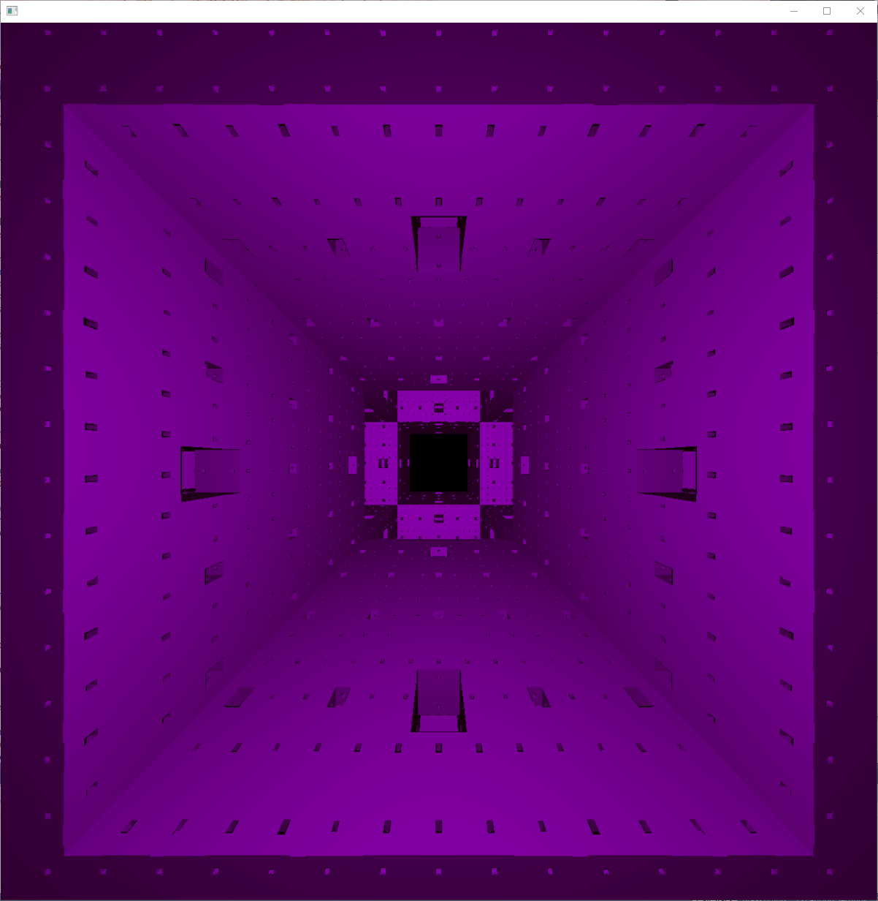
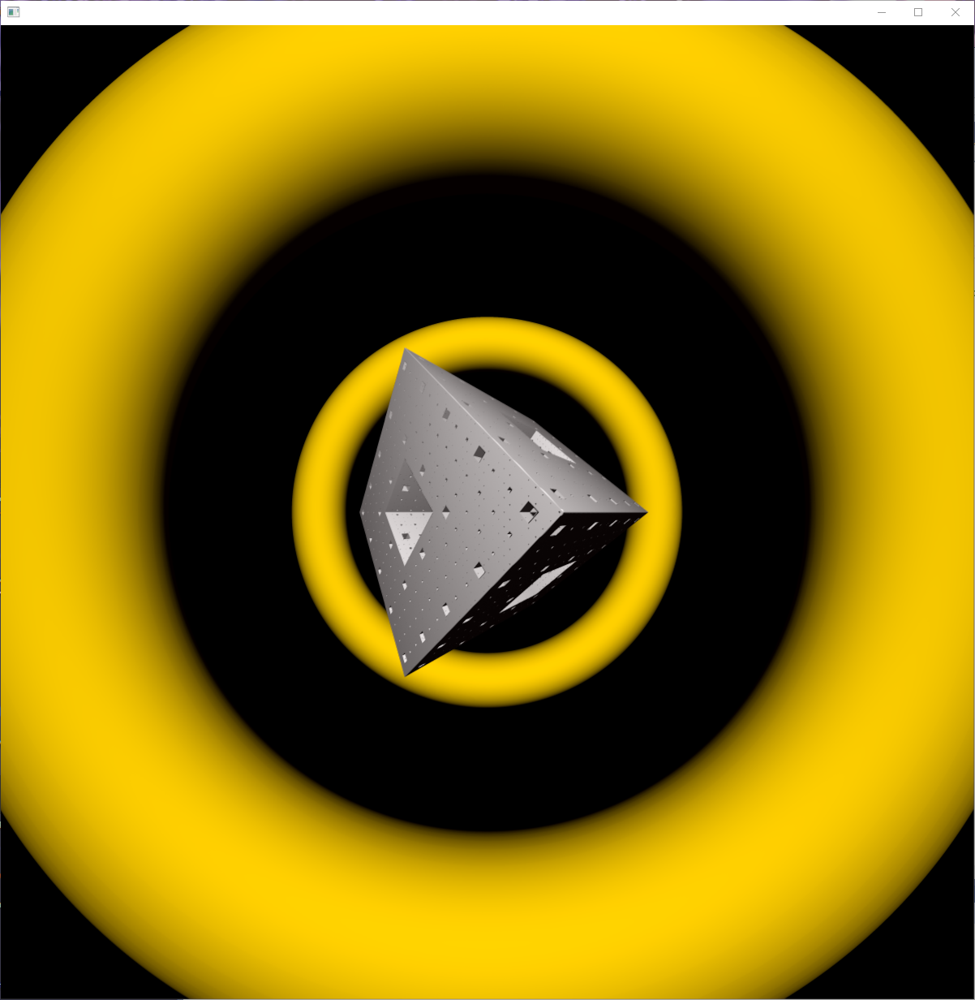
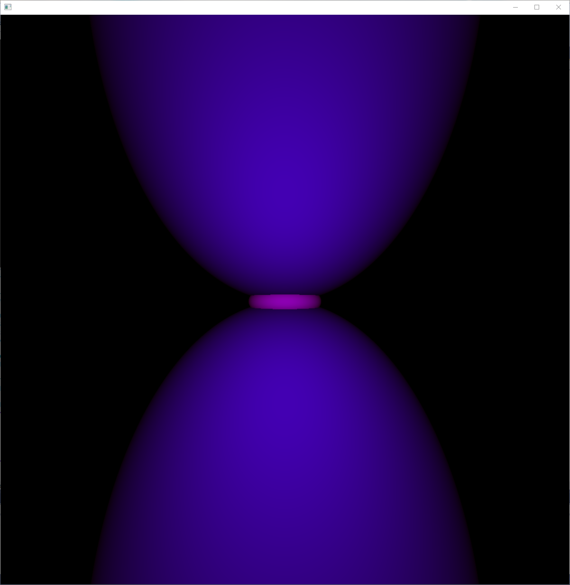
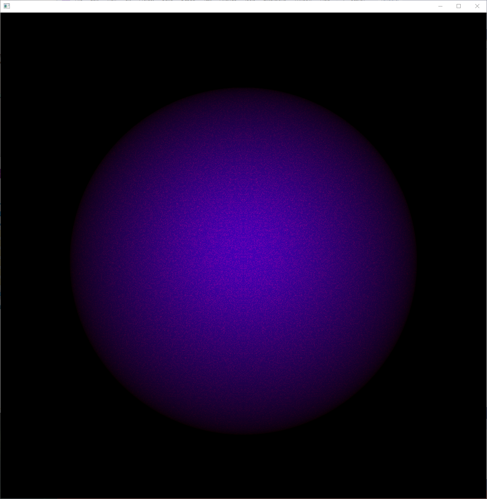

# Renderer
This was my project for my computer graphics algorithms class, but I've added some stuff beyond that for fun / interest. Almost everything is done manually except for using openFrameworks matrix multiplication and to display the pixels (I made my own matrix multiplication, but openFrameworks was about 40x faster so I switched for now). Includes soft shadows, reflections, anti-aliasing (supersampling), and multi-core rendering.

## Examples
Here are a few mostly-working examples:

Even things that are unintentional can be pretty fun, like here's a sphere and torus overlapping:

### Install Instructions:
1. Git clone this repo
2. Download correct version of openFrameworks (make sure it's the Visual Studio version if you use Visual Studio!). Last tested versions: OF 11.2 + VS 2022
3. Use openFrameworks project generator to import cloned version
4. Fix any project errors (for example, not including the include folder)

Note: Colors are RGB 0-1, going above 1 isn't blocked because it can be fun but only if you remember that's why it looks weird!
